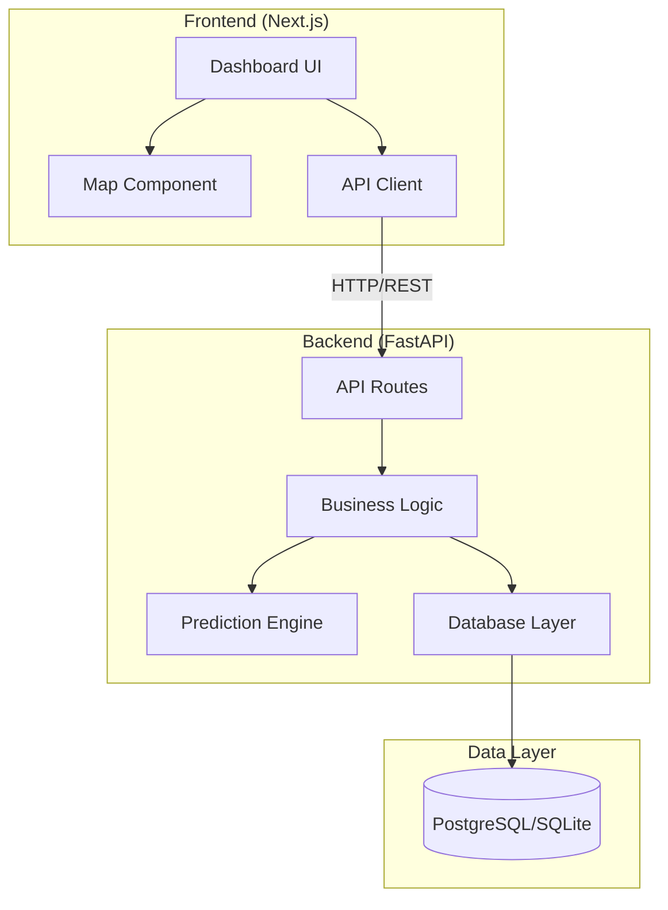
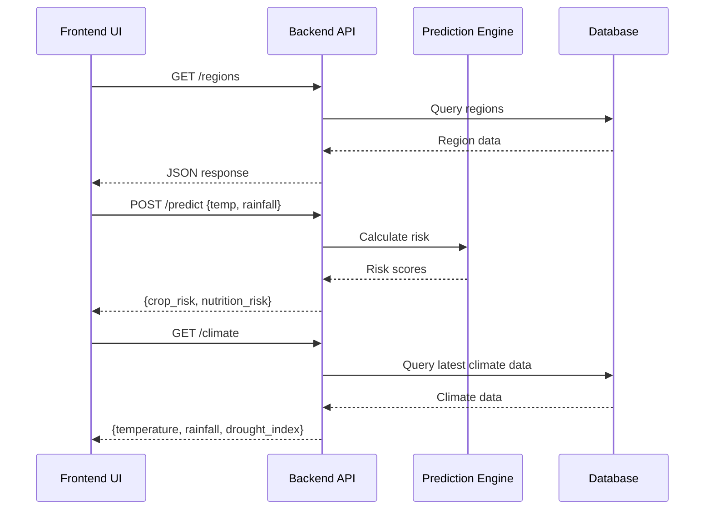

# Design Document: HarvestAlert MVP

## Overview

HarvestAlert is an AI-powered Climate & Nutrition Early Warning Platform that predicts crop failure and malnutrition risk using climate data. The system consists of two main components:

1. **Backend API** (FastAPI/Python): Provides REST endpoints for climate data, risk predictions, and region information
2. **Frontend Dashboard** (Next.js/React): Interactive map-based interface for visualizing risk data

The MVP focuses on demonstrating core functionality with sample data, rule-based predictions, and low-bandwidth optimization for deployment in resource-constrained environments.

### Key Design Goals

- **Simplicity**: Rule-based prediction logic for rapid MVP validation
- **Performance**: Sub-2-second API responses, sub-3-second page loads
- **Low-bandwidth optimization**: Minimal data transfer (<500KB initial load)
- **Extensibility**: Architecture supports future ML model integration
- **Reliability**: Persistent data storage with PostgreSQL/SQLite

## Architecture

### System Architecture



### Technology Stack

**Backend:**
- FastAPI (Python 3.9+)
- SQLAlchemy (ORM)
- PostgreSQL or SQLite
- Uvicorn (ASGI server)
- Pydantic (data validation)

**Frontend:**
- Next.js 14+ (App Router)
- React 18+
- TypeScript
- Tailwind CSS
- Leaflet (map library)
- React-Leaflet (React bindings)

### Deployment Architecture

```
┌─────────────────┐
│   Frontend      │
│   (Next.js)     │
│   Port: 3000    │
└────────┬────────┘
         │ HTTP
         ▼
┌─────────────────┐
│   Backend API   │
│   (FastAPI)     │
│   Port: 8000    │
└────────┬────────┘
         │
         ▼
┌─────────────────┐
│   Database      │
│ (PostgreSQL/    │
│   SQLite)       │
└─────────────────┘
```

## Components and Interfaces

### Backend Components

#### 1. API Routes (`backend/routes/`)

**`climate.py`**
- `GET /climate`: Returns current climate data
- Response: `{ temperature: float, rainfall: float, drought_index: float }`

**`predict.py`**
- `POST /predict`: Accepts climate parameters, returns risk predictions
- Request: `{ temperature: float, rainfall: float }`
- Response: `{ crop_risk: str, nutrition_risk: str }`

**`regions.py`**
- `GET /regions`: Returns list of all regions with risk data
- Response: `[{ id: int, name: str, latitude: float, longitude: float, crop_risk: str, nutrition_risk: str, last_updated: str }]`

**`alerts.py` (Bonus)**
- `POST /alerts/sms`: Sends SMS alert (mock implementation)
- Request: `{ phone: str, message: str }`
- Response: `{ success: bool, message_id: str }`

#### 2. Models (`backend/models/`)

**`region.py`**
```python
class Region(Base):
    __tablename__ = "regions"
    
    id: int (primary key)
    name: str
    latitude: float
    longitude: float
    crop_risk: str  # "low", "medium", "high"
    nutrition_risk: str  # "low", "medium", "high"
    last_updated: datetime
```

**`climate_data.py`**
```python
class ClimateData(Base):
    __tablename__ = "climate_data"
    
    id: int (primary key)
    region_id: int (foreign key)
    temperature: float  # Celsius
    rainfall: float  # millimeters
    drought_index: float  # 0-100 scale
    recorded_at: datetime
```

#### 3. Services (`backend/services/`)

**`climate_service.py`**
- `get_current_climate()`: Retrieves latest climate data
- `get_climate_by_region(region_id)`: Gets climate data for specific region

**`prediction_service.py`**
- `predict_risk(temperature, rainfall)`: Calculates crop and nutrition risk
- Rule-based logic:
  - High crop risk: rainfall < 50mm AND temperature > 30°C
  - Medium crop risk: rainfall < 100mm OR temperature > 35°C
  - Low crop risk: otherwise
  - Nutrition risk: derived from crop risk (high crop → high/medium nutrition)

**`region_service.py`**
- `get_all_regions()`: Fetches all regions with current risk levels
- `update_region_risk(region_id, crop_risk, nutrition_risk)`: Updates risk data
- `get_region_by_id(region_id)`: Retrieves single region

### Frontend Components

#### 1. Pages (`frontend/app/`)

**`page.tsx`** (Main Dashboard)
- Root page component
- Fetches region data on mount
- Renders map and summary cards
- Handles loading and error states

#### 2. Components (`frontend/components/`)

**`Map.tsx`**
- Interactive Leaflet map
- Renders region markers with color coding
- Handles marker click events
- Props: `regions: Region[]`, `onMarkerClick: (region) => void`

**`RegionMarker.tsx`**
- Individual map marker component
- Color-coded by risk level (green/yellow/red)
- Displays popup with region details
- Props: `region: Region`

**`RiskSummaryCard.tsx`**
- Summary card showing risk statistics
- Displays count of regions by risk level
- Color-coded indicators
- Props: `regions: Region[]`

**`ErrorMessage.tsx`**
- Error display component
- Shows user-friendly error messages
- Props: `message: string`, `onRetry?: () => void`

**`LoadingSpinner.tsx`**
- Loading state indicator
- Used during API calls

#### 3. API Client (`frontend/lib/`)

**`api.ts`**
```typescript
export async function fetchRegions(): Promise<Region[]>
export async function fetchClimate(): Promise<ClimateData>
export async function predictRisk(params: PredictParams): Promise<RiskPrediction>
```

**`types.ts`**
```typescript
interface Region {
  id: number
  name: string
  latitude: number
  longitude: number
  crop_risk: "low" | "medium" | "high"
  nutrition_risk: "low" | "medium" | "high"
  last_updated: string
}

interface ClimateData {
  temperature: number
  rainfall: number
  drought_index: number
}

interface RiskPrediction {
  crop_risk: "low" | "medium" | "high"
  nutrition_risk: "low" | "medium" | "high"
}
```

## Data Models

### Database Schema

```sql
-- Regions table
CREATE TABLE regions (
    id SERIAL PRIMARY KEY,
    name VARCHAR(255) NOT NULL,
    latitude DECIMAL(9, 6) NOT NULL,
    longitude DECIMAL(9, 6) NOT NULL,
    crop_risk VARCHAR(10) NOT NULL CHECK (crop_risk IN ('low', 'medium', 'high')),
    nutrition_risk VARCHAR(10) NOT NULL CHECK (nutrition_risk IN ('low', 'medium', 'high')),
    last_updated TIMESTAMP NOT NULL DEFAULT CURRENT_TIMESTAMP,
    CONSTRAINT valid_latitude CHECK (latitude >= -90 AND latitude <= 90),
    CONSTRAINT valid_longitude CHECK (longitude >= -180 AND longitude <= 180)
);

-- Climate data table
CREATE TABLE climate_data (
    id SERIAL PRIMARY KEY,
    region_id INTEGER NOT NULL REFERENCES regions(id) ON DELETE CASCADE,
    temperature DECIMAL(5, 2) NOT NULL,
    rainfall DECIMAL(6, 2) NOT NULL,
    drought_index DECIMAL(5, 2) NOT NULL CHECK (drought_index >= 0 AND drought_index <= 100),
    recorded_at TIMESTAMP NOT NULL DEFAULT CURRENT_TIMESTAMP,
    CONSTRAINT valid_temperature CHECK (temperature >= -50 AND temperature <= 60)
);

-- Index for performance
CREATE INDEX idx_climate_data_region_id ON climate_data(region_id);
CREATE INDEX idx_climate_data_recorded_at ON climate_data(recorded_at DESC);
```

### Sample Data

**Regions:**
```json
[
  {
    "id": 1,
    "name": "Sahel Region",
    "latitude": 14.5,
    "longitude": -14.5,
    "crop_risk": "high",
    "nutrition_risk": "high"
  },
  {
    "id": 2,
    "name": "East Africa Highlands",
    "latitude": -1.3,
    "longitude": 36.8,
    "crop_risk": "medium",
    "nutrition_risk": "medium"
  },
  {
    "id": 3,
    "name": "Southern Africa Plains",
    "latitude": -25.7,
    "longitude": 28.2,
    "crop_risk": "low",
    "nutrition_risk": "low"
  }
]
```

### API Data Flow



## Prediction Engine Logic

### Rule-Based Algorithm (MVP)

The prediction engine uses threshold-based rules for the MVP:

```python
def predict_crop_risk(temperature: float, rainfall: float) -> str:
    """
    Predicts crop risk based on temperature and rainfall.
    
    Rules:
    - High risk: rainfall < 50mm AND temperature > 30°C
    - Medium risk: rainfall < 100mm OR temperature > 35°C
    - Low risk: otherwise
    """
    if rainfall < 50 and temperature > 30:
        return "high"
    elif rainfall < 100 or temperature > 35:
        return "medium"
    else:
        return "low"

def predict_nutrition_risk(crop_risk: str, rainfall: float) -> str:
    """
    Predicts nutrition risk based on crop risk.
    
    Rules:
    - High crop risk → high or medium nutrition risk (based on rainfall)
    - Medium crop risk → medium nutrition risk
    - Low crop risk → low nutrition risk
    """
    if crop_risk == "high":
        return "high" if rainfall < 30 else "medium"
    elif crop_risk == "medium":
        return "medium"
    else:
        return "low"
```

### Drought Index Calculation

```python
def calculate_drought_index(temperature: float, rainfall: float) -> float:
    """
    Calculates drought index on 0-100 scale.
    
    Formula: (temperature / 50) * 50 + (1 - rainfall / 300) * 50
    - Higher temperature increases index
    - Lower rainfall increases index
    - Clamped to 0-100 range
    """
    temp_component = (temperature / 50) * 50
    rainfall_component = (1 - min(rainfall, 300) / 300) * 50
    drought_index = temp_component + rainfall_component
    return max(0, min(100, drought_index))
```

### Future ML Model Integration

The architecture supports replacing rule-based logic with ML models:

```python
class PredictionEngine:
    def __init__(self, model_type: str = "rule_based"):
        if model_type == "ml":
            self.model = self._load_ml_model()
        else:
            self.model = None
    
    def predict(self, features: dict) -> dict:
        if self.model:
            return self._ml_predict(features)
        else:
            return self._rule_based_predict(features)
```


## Correctness Properties

*A property is a characteristic or behavior that should hold true across all valid executions of a system—essentially, a formal statement about what the system should do. Properties serve as the bridge between human-readable specifications and machine-verifiable correctness guarantees.*

### Applicability of Property-Based Testing

This feature has LIMITED applicability for property-based testing. Most requirements involve:
- API endpoint integration (infrastructure tests)
- Database operations (integration tests)
- UI rendering (snapshot/component tests)
- Performance requirements (performance tests)

However, the following pure functions with clear input/output behavior ARE suitable for PBT:
1. **Prediction engine logic** - calculates risk from climate data
2. **Risk-to-color mapping** - maps risk levels to display colors
3. **Region aggregation** - counts regions by risk level

### Property 1: Prediction Engine Output Validation

*For any* valid temperature (numeric) and rainfall (numeric) inputs, the prediction engine SHALL return crop_risk and nutrition_risk values that are each one of the three valid risk levels: "low", "medium", or "high".

**Validates: Requirements 2.2, 2.3, 2.4**

### Property 2: High Risk Threshold Rule

*For any* temperature value greater than 30°C AND any rainfall value less than 50mm, the prediction engine SHALL classify crop_risk as "high".

**Validates: Requirements 2.5**

### Property 3: Crop-Nutrition Risk Relationship

*For any* temperature and rainfall inputs that result in crop_risk being classified as "high", the prediction engine SHALL classify nutrition_risk as either "high" or "medium" (never "low").

**Validates: Requirements 2.6**

### Property 4: Risk Level Color Mapping

*For any* risk level value in {"low", "medium", "high"}, the color mapping function SHALL return exactly one of the valid color codes: green for "low", yellow for "medium", or red for "high".

**Validates: Requirements 4.4, 5.4**

### Property 5: Region Count Aggregation

*For any* list of regions with risk level assignments, the aggregation function SHALL return counts where the sum of low_count + medium_count + high_count equals the total number of regions in the input list.

**Validates: Requirements 5.2**

## Error Handling

### Backend Error Handling

#### API Level Errors

**Invalid Input Parameters:**
```python
@app.post("/predict")
async def predict(request: PredictRequest):
    try:
        # Validate input ranges
        if not (-50 <= request.temperature <= 60):
            raise HTTPException(
                status_code=400,
                detail="Temperature must be between -50 and 60 Celsius"
            )
        if not (0 <= request.rainfall <= 1000):
            raise HTTPException(
                status_code=400,
                detail="Rainfall must be between 0 and 1000 mm"
            )
        # Process prediction
        result = prediction_service.predict_risk(
            request.temperature, 
            request.rainfall
        )
        return result
    except ValueError as e:
        raise HTTPException(status_code=400, detail=str(e))
    except Exception as e:
        logger.error(f"Prediction error: {e}")
        raise HTTPException(
            status_code=500,
            detail="Internal server error during prediction"
        )
```

**Database Connection Errors:**
```python
@app.get("/regions")
async def get_regions():
    try:
        regions = await region_service.get_all_regions()
        return regions
    except DatabaseError as e:
        logger.error(f"Database error: {e}")
        raise HTTPException(
            status_code=503,
            detail="Database temporarily unavailable"
        )
    except Exception as e:
        logger.error(f"Unexpected error: {e}")
        raise HTTPException(
            status_code=500,
            detail="Internal server error"
        )
```

**Resource Not Found:**
```python
@app.get("/regions/{region_id}")
async def get_region(region_id: int):
    region = await region_service.get_region_by_id(region_id)
    if not region:
        raise HTTPException(
            status_code=404,
            detail=f"Region with id {region_id} not found"
        )
    return region
```

#### Service Level Errors

**Data Validation:**
- Validate coordinate ranges: latitude [-90, 90], longitude [-180, 180]
- Validate risk level enums: only "low", "medium", "high"
- Validate climate data ranges: temperature [-50, 60], rainfall [0, 1000], drought_index [0, 100]

**Graceful Degradation:**
- If database is unavailable, return cached data with stale indicator
- If prediction service fails, return last known risk levels
- Log all errors with context for debugging

### Frontend Error Handling

#### API Request Errors

**Network Failures:**
```typescript
async function fetchRegions(): Promise<Region[]> {
  try {
    const response = await fetch(`${API_BASE_URL}/regions`, {
      signal: AbortSignal.timeout(5000) // 5 second timeout
    });
    
    if (!response.ok) {
      throw new Error(`HTTP ${response.status}: ${response.statusText}`);
    }
    
    return await response.json();
  } catch (error) {
    if (error instanceof TypeError) {
      // Network error
      throw new Error("Network error: Please check your connection");
    } else if (error.name === 'AbortError') {
      // Timeout
      throw new Error("Request timeout: Server is not responding");
    } else {
      throw new Error(`Failed to fetch regions: ${error.message}`);
    }
  }
}
```

**Error Display Component:**
```typescript
export function ErrorMessage({ 
  message, 
  onRetry 
}: { 
  message: string; 
  onRetry?: () => void 
}) {
  return (
    <div className="bg-red-50 border border-red-200 rounded p-4">
      <p className="text-red-800">{message}</p>
      {onRetry && (
        <button 
          onClick={onRetry}
          className="mt-2 px-4 py-2 bg-red-600 text-white rounded hover:bg-red-700"
        >
          Retry
        </button>
      )}
    </div>
  );
}
```

#### Data Validation

**Client-Side Validation:**
```typescript
function validateRegion(region: any): region is Region {
  return (
    typeof region.id === 'number' &&
    typeof region.name === 'string' &&
    typeof region.latitude === 'number' &&
    typeof region.longitude === 'number' &&
    region.latitude >= -90 && region.latitude <= 90 &&
    region.longitude >= -180 && region.longitude <= 180 &&
    ['low', 'medium', 'high'].includes(region.crop_risk) &&
    ['low', 'medium', 'high'].includes(region.nutrition_risk)
  );
}
```

#### Loading States

**Skeleton Loading:**
- Display skeleton UI while data loads
- Show loading spinner for map initialization
- Disable interactive elements during API calls

**Timeout Handling:**
- Set 5-second timeout for API requests
- Display timeout message with retry option
- Fall back to cached data if available

### Error Logging

**Backend Logging:**
```python
import logging

logger = logging.getLogger(__name__)
logger.setLevel(logging.INFO)

# Log all API requests
@app.middleware("http")
async def log_requests(request: Request, call_next):
    logger.info(f"{request.method} {request.url}")
    try:
        response = await call_next(request)
        logger.info(f"Response status: {response.status_code}")
        return response
    except Exception as e:
        logger.error(f"Request failed: {e}", exc_info=True)
        raise
```

**Frontend Logging:**
```typescript
// Log errors to console in development, send to monitoring in production
function logError(error: Error, context: string) {
  console.error(`[${context}]`, error);
  
  if (process.env.NODE_ENV === 'production') {
    // Send to monitoring service (e.g., Sentry)
    // monitoringService.captureException(error, { context });
  }
}
```

## Testing Strategy

### Overview

The HarvestAlert MVP requires a multi-layered testing approach:

1. **Property-Based Tests**: For pure functions with universal properties (prediction logic, data transformations)
2. **Unit Tests**: For specific examples, edge cases, and component logic
3. **Integration Tests**: For API endpoints, database operations, and service interactions
4. **End-to-End Tests**: For critical user workflows

### Property-Based Testing

**Scope**: Limited to pure functions with clear input/output behavior

**Library**: `hypothesis` (Python) for backend, `fast-check` (TypeScript) for frontend

**Configuration**: Minimum 100 iterations per property test

**Test Tagging**: Each property test must reference its design document property
- Format: `# Feature: harvest-alert-mvp, Property {number}: {property_text}`

#### Backend Property Tests

**Test File**: `backend/tests/test_prediction_properties.py`

```python
from hypothesis import given, strategies as st
import pytest

# Feature: harvest-alert-mvp, Property 1: Prediction Engine Output Validation
@given(
    temperature=st.floats(min_value=-50, max_value=60, allow_nan=False),
    rainfall=st.floats(min_value=0, max_value=1000, allow_nan=False)
)
def test_prediction_output_validation(temperature, rainfall):
    """For any valid temperature and rainfall, output must be valid risk levels."""
    result = predict_risk(temperature, rainfall)
    
    assert result['crop_risk'] in ['low', 'medium', 'high']
    assert result['nutrition_risk'] in ['low', 'medium', 'high']

# Feature: harvest-alert-mvp, Property 2: High Risk Threshold Rule
@given(
    temperature=st.floats(min_value=30.01, max_value=60),
    rainfall=st.floats(min_value=0, max_value=49.99)
)
def test_high_risk_threshold(temperature, rainfall):
    """For temp > 30 and rainfall < 50, crop_risk must be high."""
    result = predict_risk(temperature, rainfall)
    
    assert result['crop_risk'] == 'high'

# Feature: harvest-alert-mvp, Property 3: Crop-Nutrition Risk Relationship
@given(
    temperature=st.floats(min_value=30.01, max_value=60),
    rainfall=st.floats(min_value=0, max_value=49.99)
)
def test_crop_nutrition_relationship(temperature, rainfall):
    """When crop_risk is high, nutrition_risk must be high or medium."""
    result = predict_risk(temperature, rainfall)
    
    if result['crop_risk'] == 'high':
        assert result['nutrition_risk'] in ['high', 'medium']
```

#### Frontend Property Tests

**Test File**: `frontend/__tests__/properties.test.ts`

```typescript
import fc from 'fast-check';
import { getRiskColor, aggregateRegionCounts } from '@/lib/utils';

// Feature: harvest-alert-mvp, Property 4: Risk Level Color Mapping
describe('Property 4: Risk Level Color Mapping', () => {
  it('maps risk levels to correct colors for all valid inputs', () => {
    fc.assert(
      fc.property(
        fc.constantFrom('low', 'medium', 'high'),
        (riskLevel) => {
          const color = getRiskColor(riskLevel);
          
          if (riskLevel === 'low') return color === 'green';
          if (riskLevel === 'medium') return color === 'yellow';
          if (riskLevel === 'high') return color === 'red';
          return false;
        }
      ),
      { numRuns: 100 }
    );
  });
});

// Feature: harvest-alert-mvp, Property 5: Region Count Aggregation
describe('Property 5: Region Count Aggregation', () => {
  it('counts sum to total number of regions', () => {
    fc.assert(
      fc.property(
        fc.array(
          fc.record({
            id: fc.integer(),
            name: fc.string(),
            latitude: fc.float({ min: -90, max: 90 }),
            longitude: fc.float({ min: -180, max: 180 }),
            crop_risk: fc.constantFrom('low', 'medium', 'high'),
            nutrition_risk: fc.constantFrom('low', 'medium', 'high'),
            last_updated: fc.date().map(d => d.toISOString())
          })
        ),
        (regions) => {
          const counts = aggregateRegionCounts(regions);
          
          return counts.low + counts.medium + counts.high === regions.length;
        }
      ),
      { numRuns: 100 }
    );
  });
});
```

### Unit Testing

**Purpose**: Test specific examples, edge cases, and component logic

#### Backend Unit Tests

**Test File**: `backend/tests/test_prediction_service.py`

```python
import pytest
from services.prediction_service import predict_risk, calculate_drought_index

class TestPredictionService:
    def test_high_risk_example(self):
        """Example: High temperature and low rainfall → high risk"""
        result = predict_risk(temperature=35, rainfall=30)
        assert result['crop_risk'] == 'high'
        assert result['nutrition_risk'] in ['high', 'medium']
    
    def test_low_risk_example(self):
        """Example: Moderate temperature and good rainfall → low risk"""
        result = predict_risk(temperature=25, rainfall=150)
        assert result['crop_risk'] == 'low'
        assert result['nutrition_risk'] == 'low'
    
    def test_medium_risk_example(self):
        """Example: Borderline conditions → medium risk"""
        result = predict_risk(temperature=32, rainfall=80)
        assert result['crop_risk'] == 'medium'
    
    def test_drought_index_calculation(self):
        """Test drought index formula"""
        index = calculate_drought_index(temperature=40, rainfall=20)
        assert 0 <= index <= 100
        assert index > 50  # Should be high drought index
    
    def test_edge_case_zero_rainfall(self):
        """Edge case: Zero rainfall"""
        result = predict_risk(temperature=35, rainfall=0)
        assert result['crop_risk'] == 'high'
    
    def test_edge_case_extreme_temperature(self):
        """Edge case: Extreme temperature"""
        result = predict_risk(temperature=50, rainfall=100)
        assert result['crop_risk'] in ['medium', 'high']
```

#### Frontend Unit Tests

**Test File**: `frontend/__tests__/components/RiskSummaryCard.test.tsx`

```typescript
import { render, screen } from '@testing-library/react';
import RiskSummaryCard from '@/components/RiskSummaryCard';

describe('RiskSummaryCard', () => {
  it('displays correct counts for each risk level', () => {
    const regions = [
      { id: 1, name: 'A', lat: 0, lng: 0, crop_risk: 'high', nutrition_risk: 'high', last_updated: '' },
      { id: 2, name: 'B', lat: 0, lng: 0, crop_risk: 'high', nutrition_risk: 'high', last_updated: '' },
      { id: 3, name: 'C', lat: 0, lng: 0, crop_risk: 'medium', nutrition_risk: 'medium', last_updated: '' },
      { id: 4, name: 'D', lat: 0, lng: 0, crop_risk: 'low', nutrition_risk: 'low', last_updated: '' },
    ];
    
    render(<RiskSummaryCard regions={regions} />);
    
    expect(screen.getByText(/high.*2/i)).toBeInTheDocument();
    expect(screen.getByText(/medium.*1/i)).toBeInTheDocument();
    expect(screen.getByText(/low.*1/i)).toBeInTheDocument();
  });
  
  it('handles empty region list', () => {
    render(<RiskSummaryCard regions={[]} />);
    
    expect(screen.getByText(/no regions/i)).toBeInTheDocument();
  });
});
```

### Integration Testing

**Purpose**: Test API endpoints, database operations, and service interactions

#### Backend Integration Tests

**Test File**: `backend/tests/test_api_integration.py`

```python
import pytest
from fastapi.testclient import TestClient
from main import app

client = TestClient(app)

class TestClimateEndpoint:
    def test_get_climate_data(self):
        """Test /climate endpoint returns valid data"""
        response = client.get("/climate")
        
        assert response.status_code == 200
        data = response.json()
        assert 'temperature' in data
        assert 'rainfall' in data
        assert 'drought_index' in data
        assert isinstance(data['temperature'], (int, float))
        assert isinstance(data['rainfall'], (int, float))
        assert 0 <= data['drought_index'] <= 100

class TestPredictEndpoint:
    def test_predict_with_valid_input(self):
        """Test /predict endpoint with valid parameters"""
        response = client.post("/predict", json={
            "temperature": 35,
            "rainfall": 40
        })
        
        assert response.status_code == 200
        data = response.json()
        assert data['crop_risk'] in ['low', 'medium', 'high']
        assert data['nutrition_risk'] in ['low', 'medium', 'high']
    
    def test_predict_with_invalid_temperature(self):
        """Test /predict rejects invalid temperature"""
        response = client.post("/predict", json={
            "temperature": 100,  # Invalid
            "rainfall": 50
        })
        
        assert response.status_code == 400
        assert 'temperature' in response.json()['detail'].lower()

class TestRegionsEndpoint:
    def test_get_regions(self):
        """Test /regions endpoint returns region list"""
        response = client.get("/regions")
        
        assert response.status_code == 200
        regions = response.json()
        assert isinstance(regions, list)
        assert len(regions) >= 3  # MVP requirement
        
        for region in regions:
            assert 'id' in region
            assert 'name' in region
            assert 'latitude' in region
            assert 'longitude' in region
            assert -90 <= region['latitude'] <= 90
            assert -180 <= region['longitude'] <= 180
            assert region['crop_risk'] in ['low', 'medium', 'high']
            assert region['nutrition_risk'] in ['low', 'medium', 'high']
```

#### Frontend Integration Tests

**Test File**: `frontend/__tests__/integration/api.test.ts`

```typescript
import { fetchRegions, fetchClimate, predictRisk } from '@/lib/api';

// Mock fetch
global.fetch = jest.fn();

describe('API Integration', () => {
  beforeEach(() => {
    jest.clearAllMocks();
  });
  
  it('fetches regions successfully', async () => {
    const mockRegions = [
      { id: 1, name: 'Test Region', latitude: 0, longitude: 0, crop_risk: 'low', nutrition_risk: 'low', last_updated: '' }
    ];
    
    (fetch as jest.Mock).mockResolvedValueOnce({
      ok: true,
      json: async () => mockRegions
    });
    
    const regions = await fetchRegions();
    
    expect(regions).toEqual(mockRegions);
    expect(fetch).toHaveBeenCalledWith(expect.stringContaining('/regions'), expect.any(Object));
  });
  
  it('handles network errors gracefully', async () => {
    (fetch as jest.Mock).mockRejectedValueOnce(new TypeError('Network error'));
    
    await expect(fetchRegions()).rejects.toThrow('Network error');
  });
  
  it('handles timeout errors', async () => {
    const abortError = new Error('Timeout');
    abortError.name = 'AbortError';
    
    (fetch as jest.Mock).mockRejectedValueOnce(abortError);
    
    await expect(fetchRegions()).rejects.toThrow('timeout');
  });
});
```

### End-to-End Testing

**Purpose**: Test critical user workflows

**Tool**: Playwright or Cypress

**Test File**: `e2e/dashboard.spec.ts`

```typescript
import { test, expect } from '@playwright/test';

test.describe('Dashboard E2E', () => {
  test('loads dashboard and displays map with regions', async ({ page }) => {
    await page.goto('http://localhost:3000');
    
    // Wait for map to load
    await expect(page.locator('.leaflet-container')).toBeVisible();
    
    // Check for region markers
    const markers = page.locator('.leaflet-marker-icon');
    await expect(markers).toHaveCount(3, { timeout: 5000 });
  });
  
  test('displays region details on marker click', async ({ page }) => {
    await page.goto('http://localhost:3000');
    
    // Wait for map
    await page.waitForSelector('.leaflet-marker-icon');
    
    // Click first marker
    await page.locator('.leaflet-marker-icon').first().click();
    
    // Check popup appears
    await expect(page.locator('.leaflet-popup')).toBeVisible();
    await expect(page.locator('.leaflet-popup')).toContainText(/crop.*risk/i);
  });
  
  test('displays risk summary cards', async ({ page }) => {
    await page.goto('http://localhost:3000');
    
    // Check summary cards
    await expect(page.getByText(/high risk/i)).toBeVisible();
    await expect(page.getByText(/medium risk/i)).toBeVisible();
    await expect(page.getByText(/low risk/i)).toBeVisible();
  });
  
  test('handles API errors gracefully', async ({ page }) => {
    // Mock API failure
    await page.route('**/api/regions', route => route.abort());
    
    await page.goto('http://localhost:3000');
    
    // Check error message appears
    await expect(page.getByText(/error/i)).toBeVisible();
    await expect(page.getByText(/retry/i)).toBeVisible();
  });
});
```

### Performance Testing

**Purpose**: Verify response time requirements

**Test File**: `backend/tests/test_performance.py`

```python
import pytest
import time
from fastapi.testclient import TestClient
from main import app

client = TestClient(app)

class TestPerformance:
    def test_climate_endpoint_response_time(self):
        """Climate endpoint must respond within 2 seconds"""
        start = time.time()
        response = client.get("/climate")
        duration = time.time() - start
        
        assert response.status_code == 200
        assert duration < 2.0
    
    def test_predict_endpoint_response_time(self):
        """Predict endpoint must respond within 1 second"""
        start = time.time()
        response = client.post("/predict", json={
            "temperature": 35,
            "rainfall": 40
        })
        duration = time.time() - start
        
        assert response.status_code == 200
        assert duration < 1.0
    
    def test_regions_endpoint_response_time(self):
        """Regions endpoint must respond within 2 seconds"""
        start = time.time()
        response = client.get("/regions")
        duration = time.time() - start
        
        assert response.status_code == 200
        assert duration < 2.0
```

### Test Coverage Goals

- **Backend**: Minimum 80% code coverage
- **Frontend**: Minimum 70% code coverage for business logic
- **Property Tests**: 100 iterations minimum per property
- **Integration Tests**: Cover all API endpoints
- **E2E Tests**: Cover critical user workflows (map load, marker interaction, error handling)

### Continuous Integration

**CI Pipeline** (GitHub Actions example):

```yaml
name: Test Suite

on: [push, pull_request]

jobs:
  backend-tests:
    runs-on: ubuntu-latest
    steps:
      - uses: actions/checkout@v3
      - uses: actions/setup-python@v4
        with:
          python-version: '3.9'
      - run: pip install -r requirements.txt
      - run: pytest backend/tests/ --cov=backend --cov-report=xml
      - run: pytest backend/tests/test_prediction_properties.py -v  # Property tests
  
  frontend-tests:
    runs-on: ubuntu-latest
    steps:
      - uses: actions/checkout@v3
      - uses: actions/setup-node@v3
        with:
          node-version: '18'
      - run: npm install
      - run: npm test -- --coverage
      - run: npm run test:properties  # Property tests
  
  e2e-tests:
    runs-on: ubuntu-latest
    steps:
      - uses: actions/checkout@v3
      - run: docker-compose up -d
      - run: npx playwright test
```

---

## Summary

This design document provides a comprehensive blueprint for the HarvestAlert MVP, covering:

- **Architecture**: FastAPI backend + Next.js frontend with clear separation of concerns
- **Components**: Detailed breakdown of routes, services, models, and UI components
- **Data Models**: PostgreSQL/SQLite schema with validation constraints
- **API Design**: RESTful endpoints with clear request/response formats
- **Prediction Logic**: Rule-based algorithm with extensibility for ML models
- **Correctness Properties**: Property-based testing for pure functions (prediction logic, data transformations)
- **Error Handling**: Comprehensive error handling at API, service, and UI levels
- **Testing Strategy**: Multi-layered approach with property tests, unit tests, integration tests, and E2E tests

The design prioritizes simplicity for MVP validation while maintaining extensibility for future enhancements, including ML model integration, SMS alerts, offline caching, and trend visualization.
